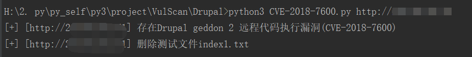
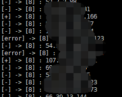

# Drupal 漏洞检测脚本

* CVE-2018-7600.py
* CVE-2018-7600_multi.py

## CVE-2018-7600.py

单个IP检测

python3 CVE-2018-7600.py http://xxx.xxx.xxx.xxx:8080

## CVE-2018-7600_multi.py

批量检测

python3 CVE-2018-7600_multi.py /root/unAuth/Drupal/us.txt 10

