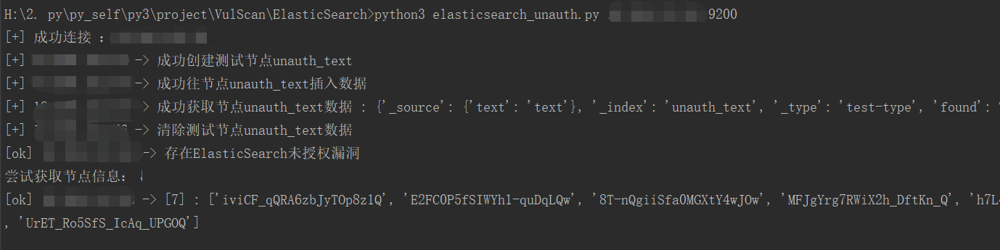
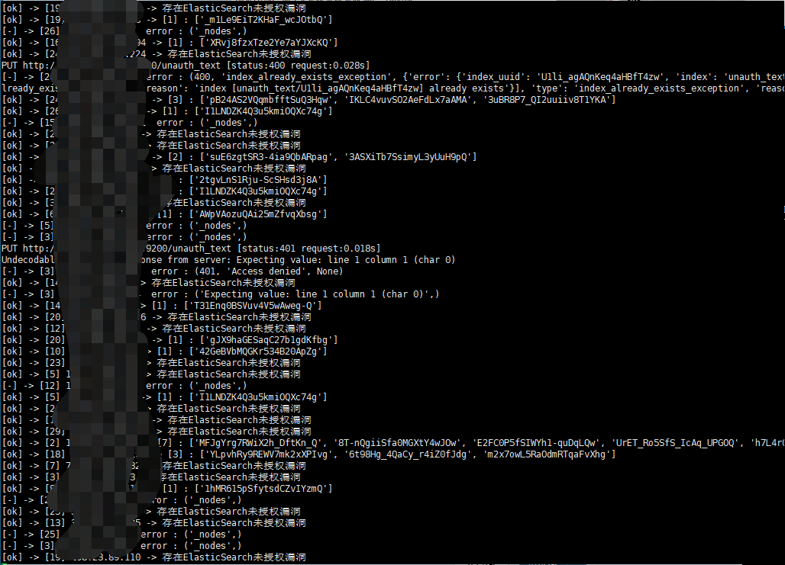

# ElasticSearch 未授权漏洞检测

* elasticsearch_unauth.py
* elasticsearch_unauth_multi.py

默认端口9200

http://localhost:9200/_plugin/head/ web管理界面

http://localhost:9200/_cat/indices

http://localhost:9200/_river/_search 查看数据库敏感信息

http://localhost:9200/_nodes 查看节点数据

## install

python3 -m pip install elasticsearch

## elasticsearch_unauth.py

单个IP检测

python3 elasticsearch_unauth.py ip port

## elasticsearch_unauth_multi.py

批量检测

python3 mongodb_unauth_multi.py /root/unAuth/elasticsearch/us.txt 10

