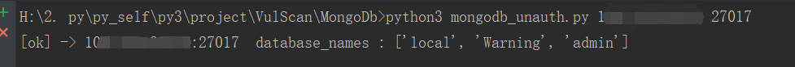
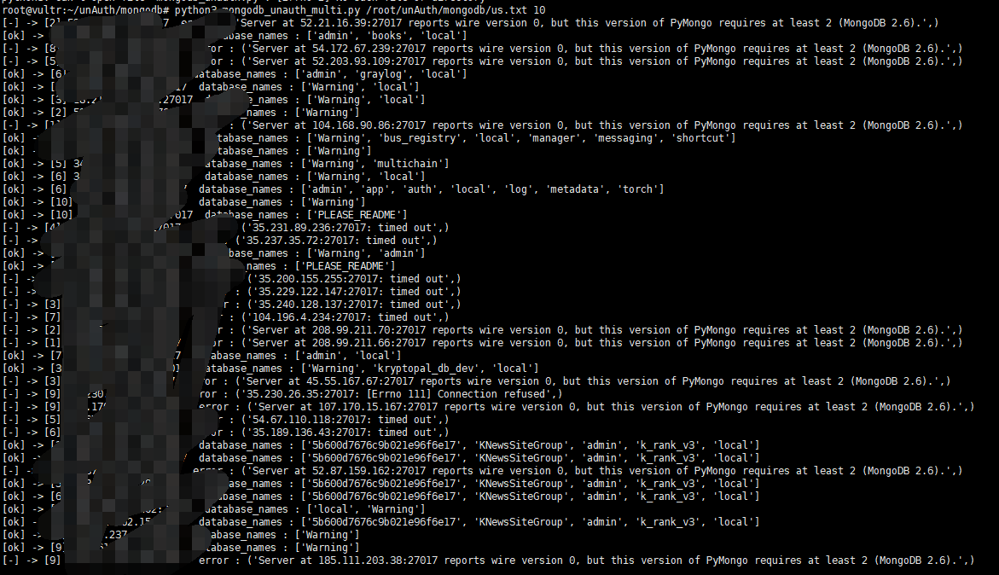

# MongoDB 未授权漏洞检测

* mongodb_unauth.py
* mongodb_unauth_multi.py

## install

python3 -m pip install pymongo

## mongodb_unauth.py

单个IP检测

python3 mongodb_unauth.py ip port

## zoo_unauth_multi.py

批量检测

python3 mongodb_unauth_multi.py /root/unAuth/mongodb/us.txt 10

