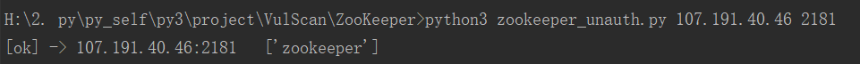
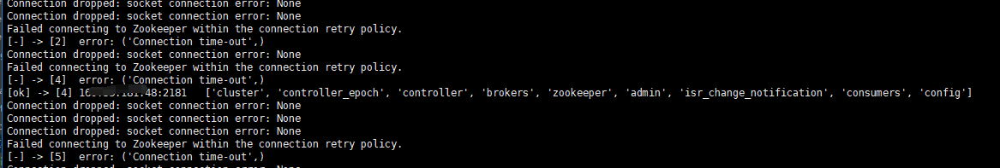

# ZooKeeper 未授权漏洞检测

* zookeeper_unauth.py
* zoo_unauth_multi.py

## install

python3 -m pip install requirements.txt

## zookeeper_unauth.py

单个IP检测

python3 zookeeper_unauth.py 107.191.40.46 2181

## zoo_unauth_multi.py

批量检测

python3 zoo_unauth_multi.py ip.txt 10

