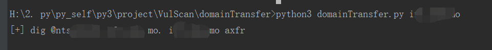
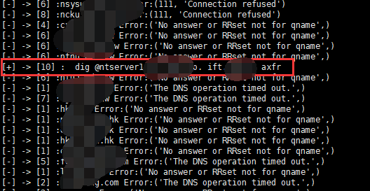
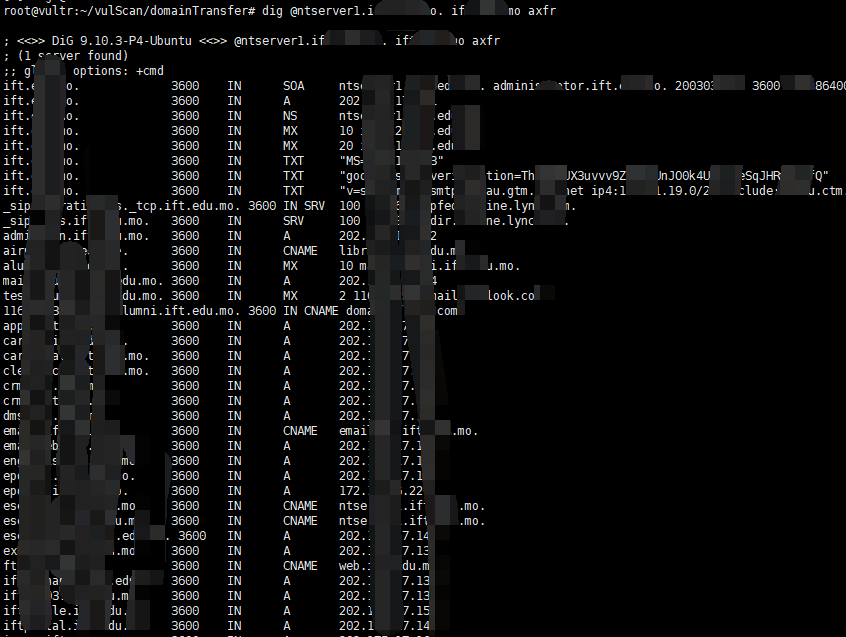
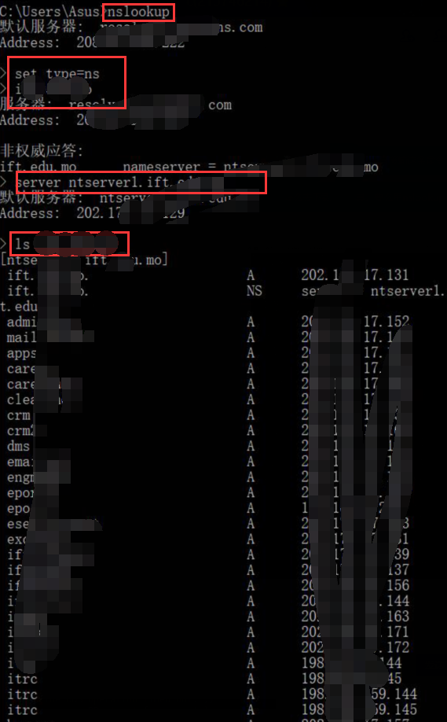

# 域传送漏洞

* domainTranstet.py
* domainTranstet_multi.py

## domainTranstet.py

python3 domainTransfer.py xxx.com




## domainTranstet_multi.py

python3 domainTransfer.py domain.txt 10



## 利用方式

```
步骤：
1、进入nslookup
2、set type=ns
3、输入根域名，会返回dns服务器
4、server 第三步返回的dns服务器
5、ls 根域名
-------------------------------------------------------------------------------

如果有dig工具：
命令格式：dig @dns服务器 根域名 axfr
dig @dns1.XXX. XXX axfr
```




