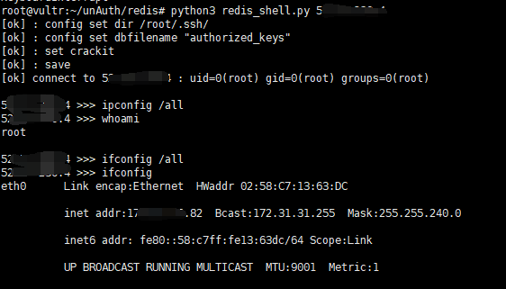
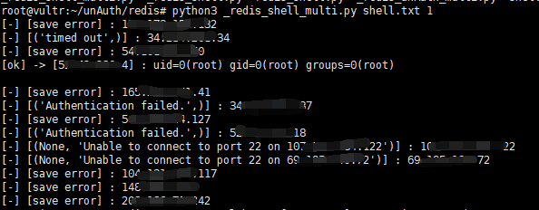

# Redis未授权检测脚本

* redis_shell.py
* redis_unAuthorized.py
* _redis_shell_multi.py
* _redis_unAuth_multi.py

## install
python3 -m pip install -r requirments.txt

## redis_shell.py

自动检测IP是否可上传公钥，如果可以建立链接，并开启交互式

eg: python3 redis_shell.py x.x.x.x

## _redis_shell_multi.py

批量检测是否存在漏洞

eg: python3 _redis_shell_multi.py ip.txt 5

ip.txt存放待检测IP，5是线程数目

